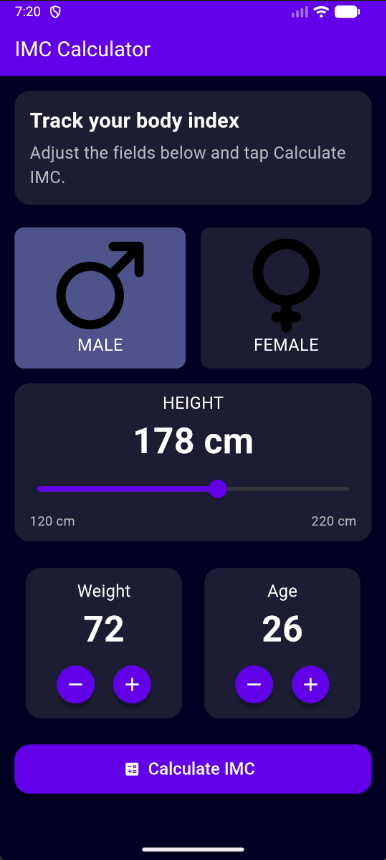
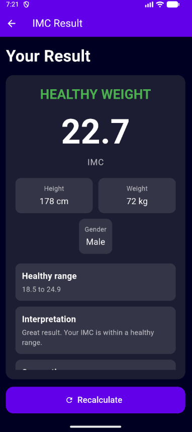

# IMC Calculator

A simple Flutter application to calculate IMC (BMI), classify the result, and present clear health guidance in a clean mobile interface.

## Table of Contents

- [Overview](#overview)
- [Features](#features)
- [Screenshots](#screenshots)
- [Tech Stack](#tech-stack)
- [Project Structure](#project-structure)
- [Getting Started](#getting-started)
- [IMC Reference](#imc-reference)
- [Known Limitations](#known-limitations)
- [Roadmap](#roadmap)
- [License](#license)

## Overview

The app provides a lightweight workflow:

1. Select gender.
2. Set height, weight, and age.
3. Calculate IMC.
4. Review category, interpretation, and recommendation.

## Features

- [x] Responsive and user-friendly layout
- [x] Gender selection cards with local assets
- [x] Height slider with visible min/max range
- [x] Weight and age selectors with clear controls
- [x] Validation guardrails for unrealistic input values
- [x] IMC result classification with actionable messaging
- [x] Medical disclaimer in the result screen

## Screenshots

| Home Screen                   | Result Screen                     |
| ----------------------------- | --------------------------------- |
|  |  |

## Tech Stack

- Flutter
- Dart
- Material Design widgets

## Project Structure

```text
lib/
  components/
    gender_selector.dart
    height_selector.dart
    number_selector.dart
  core/
    app_colors.dart
    imc_utils.dart
    text_styles.dart
  screens/
    imc_home_screen.dart
    imc_result_screen.dart
  main.dart
assets/
  images/
    male.png
    female.png
```

## Getting Started

### Prerequisites

- Flutter SDK installed
- Android Studio / VS Code with Flutter extension
- A configured emulator or physical device

### Run Locally

```bash
flutter pub get
flutter run
```

## IMC Reference

- **Underweight:** below 18.5
- **Healthy Weight:** 18.5 to 24.9
- **Overweight:** 25.0 to 29.9
- **Obesity:** 30.0 and above

> IMC is a screening metric and not a medical diagnosis.

## Known Limitations

- IMC does not directly measure body fat percentage.
- Athlete and elderly profiles may require additional interpretation.
- This app is educational and not a replacement for medical consultation.

## Roadmap

- Add automated tests for IMC calculation/classification
- Add localization support (EN/PT/ES)
- Add optional imperial units (ft/in, lb)
- Improve accessibility (larger text scaling and screen reader hints)

## License

No license file is defined yet. Add a `LICENSE` file before publishing if you want reuse terms to be explicit.
